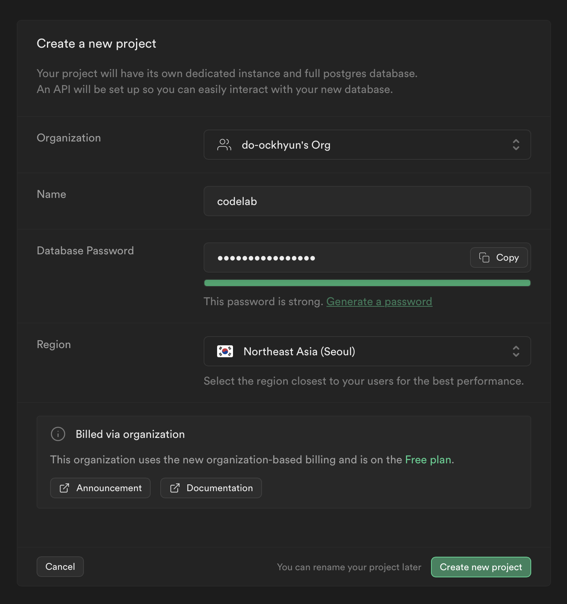
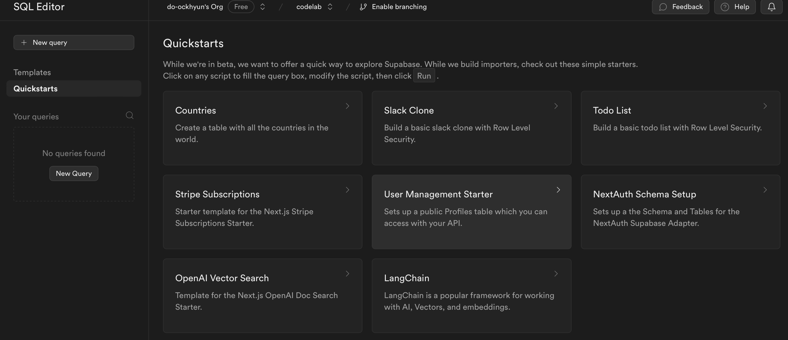
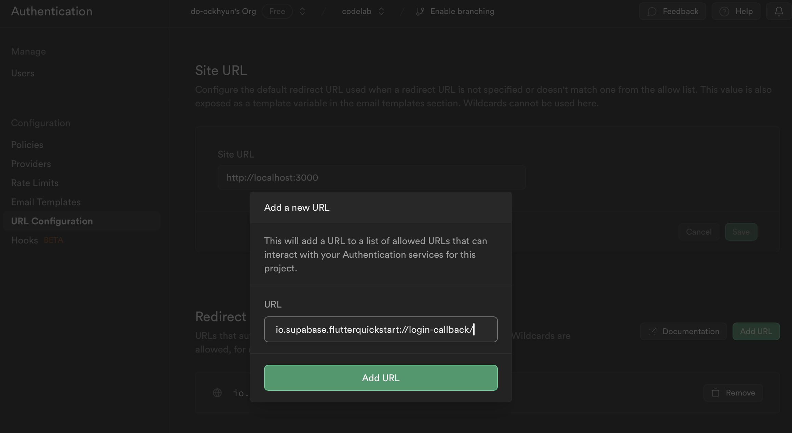
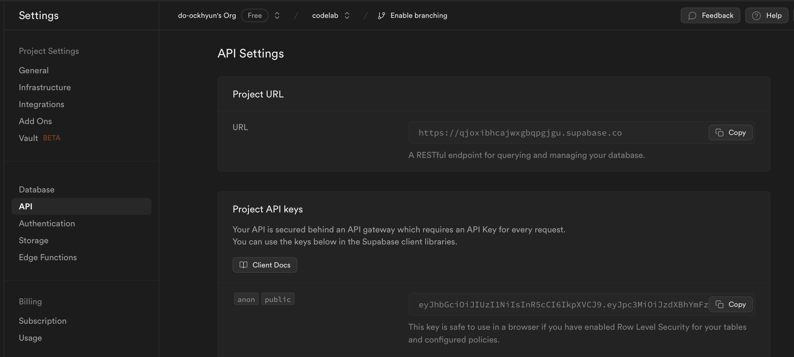

# Flutter Supbase Codelab

Flutter에서 Supabase를 빠르게 배우기 위한 코드랩 입니다.

- supabase의 예제를 가지고 실습형태로 만들어 봤습니다.
    - 원본 예제: [Build a User Management App with Fltter](https://supabase.com/docs/guides/getting-started/tutorials/with-flutter)
    - 본 실습의 완성 코드는  [complete](https://github.com/space-yireh/fultter-supabase-codelab/tree/compelete) 브랜치 를 참고해주세요
- 본 실습에서는 아래 3가지를 주로 다룹니다.
    - Authentication - Email 로 전달된 링크를 통한 인증처리
    - Database - 간단한 CRU 처리
    - Storage - 이미지 업로드와 URL를 이용한 접근
- 실습을 위해 아래 조건이 준비되어야 합니다.
    - Flutter 개발환경
    - Supabase 가입
    - 모바일 기기에서 Email 세팅

## Supabase 설정
### 1. 프로젝트 생성
- `New Project` 을 이용해서 새로운 프로젝트를 만듭니다.
- `Name`은 희망하는 이름을 입력하시고
- `Database Password`은 Generate a password 를 선택하면 자동으로 입력됩니다.
- `Region`도 원하시는 지역으로 세팅  



- 프로젝트 생성할때 약간의 시간이 걸립니다. 다른 버튼 눌러도 정상동작이 안되는 경우는 새로고침을 해보세요

### 2. Database Schema
- 2가지 형태로 설정할 수 있습니다. 
- 쉬운 방법으로는 `SQL Editor`에서 `Quickstarts` > `User Management Starter`를 하시면 자동으로 세팅됩니다.  



- SQL 문을 이용한 방법으로 아래 코드를 복사하시고, `SQL Editor`에 붙인 후 `Run` 버튼을 클릭하여 실행 합니다.
``` SQL
-- Create a table for public profiles
create table profiles (
  id uuid references auth.users not null primary key,
  updated_at timestamp with time zone,
  username text unique,
  full_name text,
  avatar_url text,
  website text,

  constraint username_length check (char_length(username) >= 3)
);
-- Set up Row Level Security (RLS)
-- See https://supabase.com/docs/guides/auth/row-level-security for more details.
alter table profiles
  enable row level security;

create policy "Public profiles are viewable by everyone." on profiles
  for select using (true);

create policy "Users can insert their own profile." on profiles
  for insert with check (auth.uid() = id);

create policy "Users can update own profile." on profiles
  for update using (auth.uid() = id);

-- This trigger automatically creates a profile entry when a new user signs up via Supabase Auth.
-- See https://supabase.com/docs/guides/auth/managing-user-data#using-triggers for more details.
create function public.handle_new_user()
returns trigger as $$
begin
  insert into public.profiles (id, full_name, avatar_url)
  values (new.id, new.raw_user_meta_data->>'full_name', new.raw_user_meta_data->>'avatar_url');
  return new;
end;
$$ language plpgsql security definer;
create trigger on_auth_user_created
  after insert on auth.users
  for each row execute procedure public.handle_new_user();

-- Set up Storage!
insert into storage.buckets (id, name)
  values ('avatars', 'avatars');

-- Set up access controls for storage.
-- See https://supabase.com/docs/guides/storage/security/access-control#policy-examples for more details.
create policy "Avatar images are publicly accessible." on storage.objects
  for select using (bucket_id = 'avatars');

create policy "Anyone can upload an avatar." on storage.objects
  for insert with check (bucket_id = 'avatars');

create policy "Anyone can update their own avatar." on storage.objects
  for update using (auth.uid() = owner) with check (bucket_id = 'avatars');
```

- `Table Editor`의 `profiles`라는 테이블이 존재하면 정상입니다.


### 3. 인증 Redirect URL 설정
- 인증 메일에서 제공되는 링크에서 App을 호출하기 위한 설정입니다.
  * `Authentication` 메뉴에서 `URL Configuration`을 선택하시고
  * `Redirect URLs` 에 `Add URL` 선택하면 나타나는 팝업에 
  * `io.supabase.flutterquickstart://login-callback/`를 입력합니다.



- android는 `android/app/src/main/AndroidManifest.xml` 파일에 아래 코드를 추가합니다.
``` xml
<manifest ...>
  <application ...>
    <activity ...>
...
      <!-- supabase deeplink  -->
      <intent-filter>
        <action android:name="android.intent.action.VIEW" />
        <category android:name="android.intent.category.DEFAULT" />
        <category android:name="android.intent.category.BROWSABLE" />
        <!-- Accepts URIs that begin with YOUR_SCHEME://YOUR_HOST -->
        <data
          android:scheme="io.supabase.flutterquickstart"
          android:host="login-callback" />
      </intent-filter>

    </activity>
  </application>
</manifest>
```
- iOS 는 `ios/Runner/Info.plist` 에 아래 코드를 추가합니다.
``` xml
<plist>
<dict>
...
	<!-- supabase deeplink  -->
  <key>CFBundleURLTypes</key>
  <array>
    <dict>
      <key>CFBundleTypeRole</key>
      <string>Editor</string>
      <key>CFBundleURLSchemes</key>
      <array>
        <string>io.supabase.flutterquickstart</string>
      </array>
    </dict>
  </array>
...  
</dict>
</plist>
```

## Code
### 1. Supabase 초기화 
- `flutter_supabase` 의 라이브러리를 추가합니다.
```
flutter pub add supabase_flutter
```
- `.env`파일을 복사하여 `.env.development`파일을 만들고, Dashboard의 `Settings > API`에서 API 정보를 참고하여 URL, KEY를 입력합니다.



```ini
SUPABASE_URL='https://qjoxi~~~.supabase.co'
SUPABASE_ANON_KEY='eyJhbGciOiJIUzI~~~'
```
- `lib/main.dart` main()에서 초기화 코드와 인스턴스 변수를 추가합니다.
```dart
Future<void> main() async {
  WidgetsFlutterBinding.ensureInitialized();
  await dotenv.load(fileName: Environment.fileName);
  
  //  supabase - initialize
  await Supabase.initialize(
    url: Environment.supabaseUrl,
    anonKey: Environment.supabaseKey,
  );

  runApp(const MyApp());
}

// supabase - instance
final supabase = Supabase.instance.client;
```

### 2. 세션체크를 통한 라우팅
- `lib/pages/splash_page.dart` 에서 인증된 세션이 있다면 `/account` 로
- 없다면 `/login` 으로 이동하는 로직을 추가합니다.
```dart
  Future<void> _redirect() async {
    ...

    //  supabase - routes by session
    final session = supabase.auth.currentSession;
    if (session != null) {
      Navigator.of(context).pushReplacementNamed('/account');
    } else {
      Navigator.of(context).pushReplacementNamed('/login');
    }
  }
```

### 3. 로그인 처리 
- 화면 진입할때 인증처리의 결과를 전달하는 리스너를 등록합니다.
```dart
class _LoginPageState extends State<LoginPage> {
...
  //  supabase - subscribe
  late final StreamSubscription<AuthState> _authStateSubscription;
...
  @override
  void initState() {
    //  supabase - subscribe
    _authStateSubscription = supabase.auth.onAuthStateChange.listen((data) {
      if (_redirecting) return;
      final session = data.session;
      if (session != null) {
        _redirecting = true;
        Navigator.of(context).pushReplacementNamed('/account');
      }
    });
...
    @override
  void dispose() {
    //  supabse - unsubscribe
    _authStateSubscription.cancel();
...
```
- 입력한 이메일 주소로 인증메일 요청하는 signInWithOtp()를 호출 합니다.
```dart
  Future<void> _signIn() async {
...
      //  supabase - sign in
      await supabase.auth.signInWithOtp(
        email: _emailController.text.trim(),
        emailRedirectTo:
            kIsWeb ? null : 'io.supabase.flutterquickstart://login-callback/',
      );
      if (mounted) {
        ScaffoldMessenger.of(context).showSnackBar(
          const SnackBar(content: Text('Check your email for a login link!')),
        );
        _emailController.clear();
      }
    } on AuthException catch (error) {
      SnackBar(
        content: Text(error.message),
        backgroundColor: Theme.of(context).colorScheme.error,
      );
    } catch (e) {
...
  }
```
- 인증메일의 링크를 클릭하면 Deep link를 통해 App이 실행되고 인증처리가 완료됩니다.

### 4. Profile 조회 및 입력 처리
- 화면 진입하면서 `Profiles` 테이블을 조회하고, 입력항목에 바인딩처리를 합니다.
```dart
  Future<void> _getProfile() async {
...
    try {
      //  supabase - get profile
      final userId = supabase.auth.currentSession!.user.id;
      final data =
          await supabase.from('profiles').select().eq('id', userId).single();
      _usernameController.text = (data['username'] ?? '') as String;
      _websiteController.text = (data['website'] ?? '') as String;
    } on PostgrestException catch (error) {
      SnackBar(
        content: Text(error.message),
        backgroundColor: Theme.of(context).colorScheme.error,
      );
    } catch (e) {
...     
  }
```
- `Update`버튼을 클릭하면 입력된 정보를 `Profiles` 테이블에 업데이트 합니다.
```dart
  Future<void> _updateProfile() async {
...
    try {
      //  supabase - update profile
      final userName = _usernameController.text.trim();
      final website = _websiteController.text.trim();

      final user = supabase.auth.currentUser;
      final updates = {
        'id': user!.id,
        'username': userName,
        'website': website,
        'updated_at': DateTime.now().toIso8601String(),
      };

      await supabase.from('profiles').upsert(updates);
      if (mounted) {
        const SnackBar(
          content: Text('Successfully updated profile!'),
        );
      }
    } on PostgrestException catch (error) {
      SnackBar(
        content: Text(error.message),
        backgroundColor: Theme.of(context).colorScheme.error,
      );
    } catch (e) {
...      
  }
```
- `SignOut`버튼 처리를 합니다.
```dart
  Future<void> _signOut() async {
    try {
      //  supabase - sign out
      await supabase.auth.signOut();
    } on AuthException catch (error) {
      SnackBar(
        content: Text(error.message),
        backgroundColor: Theme.of(context).colorScheme.error,
      );
...
  }
```
### 5. 이미지 업로드 처리 
- 업로드 이미지를 선택하기 위해 `image_picker` 라이브러리를 추가합니다
```
flutter pub add image_picker
```
- avatar.dart 파일에 선택한 이미지를 업로드 처리를 추가합니다.
```dart
  Future<void> _upload() async {
    //  supabase - imagePicker
    final picker = ImagePicker();
    final imageFile = await picker.pickImage(
        source: ImageSource.gallery, maxHeight: 300, maxWidth: 300);
    if (imageFile == null) {
      return;
    }
    setState(() {
      _isLoading = true;
    });

    try {
      final bytes = await imageFile.readAsBytes();
      final fileExt = imageFile.path.split('.').last;
      final fileName = '${DateTime.now().toIso8601String()}.$fileExt';
      final filePath = fileName;

      await supabase.storage.from('avatars').uploadBinary(filePath, bytes,
          fileOptions: FileOptions(contentType: imageFile.mimeType));

      final imageUrlResponse = await supabase.storage
          .from('avatars')
          .createSignedUrl(filePath, 60 * 60 * 24 * 265);

      widget.onUpload(imageUrlResponse);
    } on StorageException catch (error) {
      if (mounted) {
        ScaffoldMessenger.of(context).showSnackBar(
          SnackBar(
            content: Text(error.message),
            backgroundColor: Theme.of(context).colorScheme.error,
          ),
        );
      }
    } catch (e) {
...
  }
```
- account_page.dart에 Avatar 위젯을 추가하고 업로드된 이미지 정보를 저장합니다.
```dart
class _AccountPageState extends State<AccountPage> {
...
  Future<void> _getProfile() async {
...
    try {
      //  supabase - get profile
...
      _avatarUrl = (data['avatar_url'] ?? '') as String;
...
  Future<void> _onUpload(String imageUrl) async {
    try {
      // supabase - update avatar
      final userId = supabase.auth.currentUser!.id;
      await supabase
          .from('profiles')
          .upsert({'id': userId, 'avatar_url': imageUrl});
...
    } on PostgrestException catch (error) {
      SnackBar(
        content: Text(error.message),
        backgroundColor: Theme.of(context).colorScheme.error,
      );
    } catch (e) {
...
    setState(() {
      //  supabase - imageUrl
      _avatarUrl = imageUrl;
    });
  }
  @override
  Widget build(BuildContext context) {
    return Scaffold(
        appBar: AppBar(title: const Text('Account')),
        body: _loading
            ? const Center(child: CircularProgressIndicator())
            : ListView(
                padding: const EdgeInsets.all(16),
                children: [
                  // supabase - avatar
                  Avatar(imageUrl: _avatarUrl, onUpload: _onUpload),
                  const SizedBox(height: 16),
...
    );
  }
```